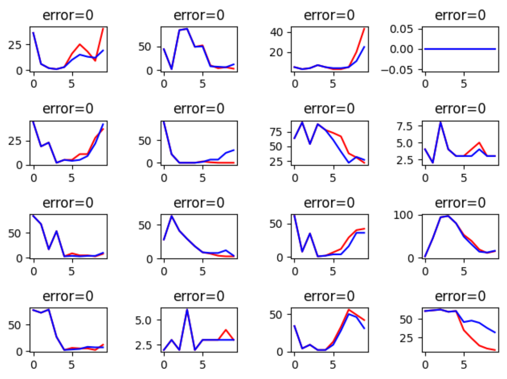
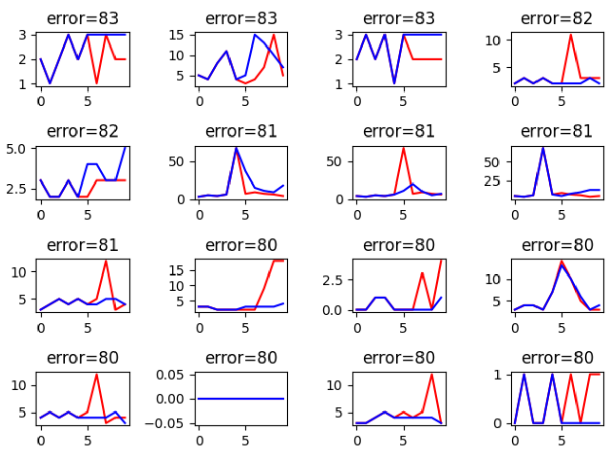
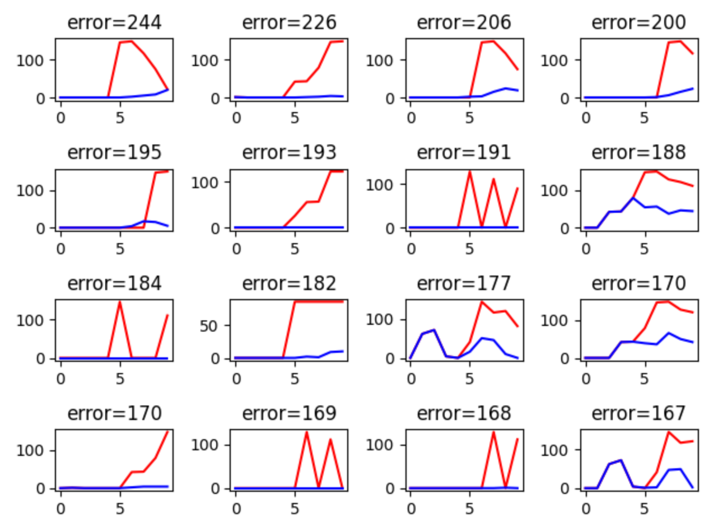
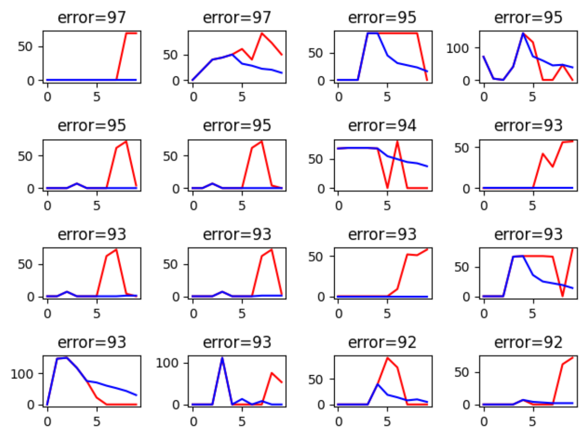

# BDCI-大数据时代的Serverless工作负载预测

## 0.摘要

severless工作负载预测问题给出服务器工作负载的时序数据，要求参赛者预测固定时间范围内的时序数据。对于该问题我们进行了基于相关性和分布的数据分析，发现severless工作负载具有波动大，不稳定等特点。随后对数据进行缺失值补充和平滑化等清洗。对清洗后数据我们进行了时间窗、特征平滑等相应的特征工程。在模型选择方面，我们对LightGBM和LineraRegression两种模型的比较，确定LightGBM作为主要模型并使用网格搜索的方式对参数进行选择，在最后的预测上我们基于投票法和直接选取LAUNCHING_JOB_NUMS最后一位的方式进行了模型的融合，最终成绩为B榜42名。

关键词:数据挖掘，特征工程，模型融合

## 1.赛题解读

### 1.1赛题内容

本赛题给出一段时间severless服务器的工作负载和属性，参赛者利用给出的多变量时序数据，预测接下来一段时间的时间负载

### 1.2数据集内容

赛题给出华为云数据湖探索（Data Lake Insight，简称DLI）中若干队列一段时间内的真实运行数据作为训练数据。同一队列中运行数据每五分钟采样一次，采样时间比赛方进行脱敏处理，但保持时间间隔不变。同时比赛方对数据集加入了噪声。

训练数据集每条数据包含队列编号，队列规格，队列CPU使用了，队列内存使用率等十五种不同类型的数据。测试数据集则按照测试集组数划分，每组测试集给出同一队列的25分钟采样的五条数据，选手需要预测接下来25分钟内的5个数据点的工作负载。

### **1. 3** 评价指标

​       赛题采用绝对误差作为评估指标，首先单独计算每个测试用例的误差值: $P_i =0.9*|cpuUsage_i - \hat{cpuUsage}|+0.1*\frac{launching_i-\hat{launching}}{max(launching_i,\hat{launching})} $

最终得分为

$Score = 1-\frac{1}{n}\sum_{i=1}^n\sum_{j=1}^5P_j$

### 1.4赛题分析

本次赛题中，主要目标应该在于建立severless服务器的工作模型，并且使用给定的数据集对相应模型进行拟合，挖掘对数据变量是否对工作负载有影响已经影响的方式。

本次赛题中主要有以下两个难点。其一，数据质量较差，CPU工作负载采样间隔较大，LAUNCHING_JOB_NUMS(正在等待运行任务数)、RUNNING_JOB_NUMS(运行中的作业数)等数据不是连续变化，加上官方进行了若干噪声处理，使得整体数据比较差。其二，工作负载模式不确定，给点前二十五分钟的数据，后二十五分钟的数据又多种合理的可能。

​	

## 2.数据清洗

### 2.1数据集分析

我们首先对数据完整性进行分析，发现DISK_USAGE和RESOURCE_TYPE两列数据存在大规模的缺失，其他的

数据则无缺失。在对数据进行进一步分析过程中，我们重点对数据的相关性，采样时间分布，重要数据的分布，

重要数据相关性具体分析四方面进行了数据的分析。

 在数据相关性方面，我们采用相关系数作为数据相关性评价指标，对全图绘制相应的相关矩阵来判断相关性，并从中选取出与主要预测目标CPU_USAGE相关的重要特征。从绘制的相关矩阵可以看出，与CPU_USAGE最为相关的特征为MEM_USAGE，这符合常规计算机运行情况。进一步地，我们具体分析内存的使用和CPU使用的具体关系

我们选取部分队列，按照时间顺序来绘制相应的CPU和内存变化关系来分析具体相关性。从变化图像上我们可以得到以下两个重要特点。其一为CPU和内存变化同步正相关，说明severless服务器运行规律与正常PC 相同。接下来则可以使用常用的分析方式，对于CPU和内存大小我们来讲不同队列划分为IO密集型队列和计算密集性队列。

第二点是CPU和内存的非常不平滑，且变化无规律。虽然整体数据范围相对稳定，但是抖动非常剧烈，我们需要在接下来的特种工程中进行数据的平滑处理。

随后我们进行采样时间的分析，统计所有队列内连续两次采样时间间隔绘制成直方图，从图像中我们可以看到采样时间并非稳定为5分钟一次，主要的采样时间间隔在6~8分钟，还有部分采样在1分钟以内。我们分析采样时间的不稳定和负载工作模式的不变性为导致波动剧烈的主要原因。

为了进一步分析severless工作负载的模式，我们对预测目标CPU_USAGE和LAUNCHING_JOB_NUMS进行数据内容统计，从直方图中我们看到绝大部分的LAUNCHING_JOB_NUMS数据为0(占据了90%以上的数据)，CPU_USAGE 也有相当大部分的数据为零。而对test进行相应数据分析，我们发现测试集的LAUNCHING_JOB_NUM和训练集的分布类似，CPU_USAGE分布则大为不同，这提醒我们我们的模型需要具备较好的泛化能力。

### 2.2数据集清洗

在进行相应分析后，我们对数据集合进行清洗，清洗主要有缺失值的填充和标签类型数值化，采样数据的平滑化，低质量数据的剔除几个工作。

在缺失值填充和标签类型数值化中，我们发现缺失的DISK_USAGE主要在队列运行前部，故我们把缺失的DISK_USAGE用0填充，RESOURCE_TYPE则用‘vm’类型填充。

在数据平滑化的过程中我们主要做了以下几个工作首先对于采样时间相同的数据，我们取其中CPU_USAGE，MEM_USAGE最大的一条，其余条数被丢弃。其次对于采样时间间隔大于10分钟的数据，我们在其中每5分钟线性地补上一条。

在低质量数据提出方面，我们根据题目要求，对每个队列内每连续十分钟内采样的十条数据合成一条。采用长度为1的窗口滑动整个训练集合，得到新数据。对于新的数据，我们判断若在该组数据中连续两次采样间隔小于三分钟或者大于8分钟则讲将该组数据丢弃。

## 3.特征工程
### 3.1 时间窗特征
本题是一个时序预测的题目，测试集中是通过前五个点的数据去预测后面五个点的预测值，所以首先是需要时间窗特征，在数据预处理以后，将相邻1十组数据当作我们训练集中的一组数据，这是因为相邻两组数据再经过数据清洗以后，可以默认相差的时间是五分钟（即相当于赛题中规定的时间差）。
在相邻的十组数据中，选择了除去标识特征以外的特征进行拼接，即CPU_USAGE,MEM_USAGE,LAUNCHING_JOB_NUMS,RUNNING_JOB_NUMS,SUCCEED_JOB_NUMS,CANCELLED_JOB_NUMS,FAILED_JOB_NUMS,DISK_USAGE。通过数据的拼接，可以很好的通过历史的五个时间的数据预测接下来五个时间点的数据，这刚好是测试集需要做的工作。

### 3.2 平滑特征
对于平滑特征来说，就是对最近的数据特征进行处理，即选择合适的时间窗，对时间窗中的数据进行处理从而可以得到新的特征。在本次赛题中，选择了两种方式进行特征处理，一种是移动平均，一种是指数平均，在训练以后发现移动平均的效果较好。
#### 移动平均
移动平均即将过去的数据赋予相同的权重进行处理，而没有对数据进行权重上的分配处理，在本赛题中即是对过去的五个时间点的数据进行平均构造新的特征。
#### 指数平滑
对于基于时序的题目来说，由于最近的数据可能会对未来的数据产生较大的影响，所以在进行完时间窗特征以后可以根据最近的5/4/3/2/个点做指数平滑特征，即可以对最近数据给予较大的权重，而对于稍远的数据给予较小的特征，这种方法是基于移动平均的改进，指数平滑法首先可以和移动平均法一样不舍弃过去的数据，并且较为重视最近的数据，这样可以在短期的预测中有较好的表现。但在本赛题中，通过比较可以发现效果没有移动平均法好。
### 3.3 描述性统计特征
统计特征可以很好的反映数据之间所存在的关系，在本次赛题中由于是通过过去5个点的数据预测未来五个点的数据，所以可以将过去五个点的统计特征加入特征工程中，在选择特征过程中，选择了最大值（max），最小值（min），平均值（mean），标准差（std），中位数（median）等
### 3.4 交互特征
由于在数据中存在CU（CPU核数）、CPU_USAGE（CPU使用率）、MEM_USAGE（内存使用率）、LAUNCHING_JOB_NUMS（正在等待任务数）、RUNNING_JOB_NUMS（正在运行任务数）这些数据的存在，所以可以添加三个交互特征分别为USED_CPU（已用CPU量），USED_MEM（已用内存量），TO_RUN_JOBS（即将要跑的任务数）。
$$
USED\_CPU=CU*CPU\_USAGE\\
USED\_CPU=CU*MEM\_USAGE\\
TO\_RUN\_JOBS = LAUNCHING\_JOB\_NUMS-RUNNING\_JOB\_NUMS
$$
### 3.5 时间特征
由于这是一个工作负载预测的题目，由于人的作息习惯的影响，可能会导致白天和夜晚中队列的使用情况不一样，所以可以加入一个小时和分钟这两个时间特征，即根据题目中的DOTTING_TIME转换为一个小时和分钟的数据加入特征工程当中。
## 4.模型选择
在进行具体的模型选择以前，首先是需要确定模型的训练与预测方式，这是因为这是一个连续性的数值预测问题，并且在预测的时候是需要预测未来五个点的数据的，所以可以采取以下两种方式进行训练：1）未来个时间点单独训练以及预测，即未来的五个点分别通过以往五个点的数据进行训练。2）在预测一个点以后加入原数据进行预测下一个时间的数据。通过尝试发现最后采取第一种方式的效果较好，猜测原因是因为第二种方式运用到了预测的数据，但预测可能不太准确，就导致后续的预测过程更加的不准确，即误差可能会累积。
训练的层级也需要进行考虑，即在数据清洗的过程中发现，不同的QUEUE_ID所对应的数据分布并不相同，所以根据**图**，可以采取以下两种层级进行训练：1）所有的QUEUE_ID一起进行训练。2）不同的QUEUE_ID分开进行训练。通过实际的尝试以后，发现在A榜中，采取第二种方式进行训练可以达到0.34的分数，但是在B榜成绩就不太理想，所以B榜采取的是第一种方式，即所有的QUEUE_ID一起进行训练。两种方式预测的CPU_USAG之间的比较如下图:蓝线（第一种方式），红线（第二种方式）。

在选择模型的时候，对于本赛题，是一个预测问题，所以可以采取XGBoost，LightGBM，Catboost这一类boosting集合模型中的新进成员，下表是各个模型进行一次预测所需要的时间：

|   模型   | XGBoost | Catboost      | LightGBM |
| :------: | ------- | ------------- | -------- |
| 训练时间 | 2oh     | 3d 3h 27m 30s | 10s以内  |
通过上表可以发现，本题可行的方案之一就是LightGBM，所以最后选择的模型是LightGBM和LR模型。
### 4.1 LightGBM
本次赛题主要选择的模型是LightGBM，这个模型是对GBDT模型的高效实现的一个模型，即这也是一个决策树模型，这个模型相对于其他模型有以下的优势：1）训练的速度快。2）更高的准确率。3）可处理大规模的数据。
选择了LightGBM模型以后，后面最重要的工作就是需要对参数进行调优，在本题中，参数对最后结果影响较大，下表是对LightGBM参数部分参数的介绍：

|    参数名     |      参数介绍      |
| :-----------: | :----------------: |
|  num_leaves   |     最大树叶数     |
|   max_depth   |    树的最大深度    |
| learning_rate |       学习率       |
| n_estimators  | 需要拟合的树的数量 |
|     seed      |     随机种子数     |
由于本题并不是线下的结果越好的时候线上的结果就会越好，有时候还是反过来的，即线下的结果较差，而线上的结果较好，所以在调优的时候并没有使用Hyperopt工具进行调优，而是选择了暴力的网格搜索的方法，选择一个线下表现结果较好的结果的参数进行模型训练。
选定了最后的参数以后，最后的结果如下图，其中红色的曲线代表的是训练集中的数据，蓝色的曲线代表的是对训练集中的数据进行预测的结果。

第一张图代表的是对CPU_USAGE的预测，可以看出模型能够捕捉到大部分的CPU_USAGE的变化趋势，第二张图代表的是对LAUNCHING_JOB_NUMS的预测由于数据集中的LAUNCHING_JOB_NUMS这一列的数据为0值的占到了所有数据的值的99%以上，所以导致对于LAUNCHING_JOB_NUMS非0值的预测时会出现很大的偏差，所以产生了对于LAUNCHING_JOB_NUMS的预测采用了下面的LinearRegression模型进行预测的想法。

### 4.2 LinearRegression
通过上面的分析可以发现，由于数据集中LAUNCHING_JOB_NUMS分布集中在0，所以如果采取LightGBM模型会导致对此数据的预测出现很大的偏差，所以采用了LR模型进行预测，对于LR模型，我们并没有进行调参，最后的预测结果如下图：

通过LR模型对LAUNCHING_JOB_NUMS的预测，虽然对于数据的波动程度并没有很好的捕捉，但是对于非0时候的LAUNCHING_JOB_NUMS的预测，有明显的变好的趋势。但是通过观察可以发现，如果前五个点的数据值都接近于0时，而后五个点的数据值变化较为明显的时候并不能进行很好的预测，这就是LR模型在本题中的局限性。

### 4.3 模型选择与融合
#### 4.3.1 模型比较

在模型比较比较方面，我们使用时间序列形似性算法DTW距离的方式来比较两条时间序列的相似性，从而进行模型的比较。对于两组时间序列，计算其相应的DTW距离矩阵$D_{ij}$ 表示第一组的第i条时间序列和第二组的第j条时间序列之间的差距，最终我们讲两组时间序列差距最大的几组使用画图的方式画出相应的时间序列差。可用于模型和模型的对比，模型和验证数据的对比。

#### 4.3.2 模型融合
模型融合一共从两个方面进行融合，第一个方面就是选择LightGBM和LR模型分别对CPU_USAGE和LAUNCHING_JOB_NUMS进行预测，通过选取不同的参数对其进行多次预测，然后进行投票法得出最后的结果，第二个方面就是CPU_USAGE和LAUNCHING_JOB_NUMS进行融合，因为这两个数据采取的是不同的方法进行预测，所以需要在最后对其进行融合。
在融合的时候发现如果选择最近的一次时间的LAUNCHING_JOB_NUMS作为后面五个时间的LAUNCHING_JOB_NUMS的值，可以让最后的结果变好，原因还是因为在数据集中LAUNCHING_JOB_NUMS中0占比太大，使得不管什么模型都可能因为0占比较大而被影响，所以在比赛结束后发现可以将全0的数据剔除掉，然后根据不是全0的数据进行训练预测，可能会让结果变得更好。

### 4.4 防止过拟合的方法
在模型训练的过程中，除了通过模型的正则化参数等进行防止过拟合，在训练的过程中，还采取了五折交叉验证（K-CV）的方式防止过拟合。
五折交叉验证即将训练集随机等大小的分为5份，在接下来的五次训练中，一次选择一份作为测试集，剩下的四份作为训练集进行训练，通过此方法可以可以在训练中映入随机性防止，降低训练方差，最后得到的结果也比较具有说服性。

## 5.总结

本次竞赛我们围绕severless工作复杂的核心挑战，主要进行了几个比较重要的过程：对基于相关性和分布对数据集进行分析、有针对性地采用低质量数据社区，平滑化等方法补全对数据集进清洗、对lightgbm和线性模型等进行比较和参数的选择、进行多个模型的融合。最终完成整个挑战，最终B榜排名为42名。

在severless工作负载预测，对于三个新手来说是一个不小的挑战。我们从baseline出发，逐渐构建了一个完整的竞赛流程，从磕磕绊绊地阅读baseline到最后完成一个完整的流程可以说是非常具有成就感的一个过程。从中我们领略到了机器学习在当前业界的前沿应用，学会了对于较为复杂数据的处理分析思路，更加深刻地理解了模型的偏差和方差对实际预测的影响。

最后感谢数据挖掘课程，给我们提供了一个这样的学习交流的机会，也感谢比赛举办方，给了我们一个接触业界前沿的机会。